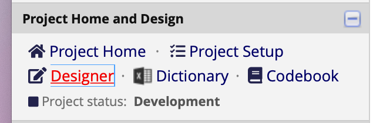
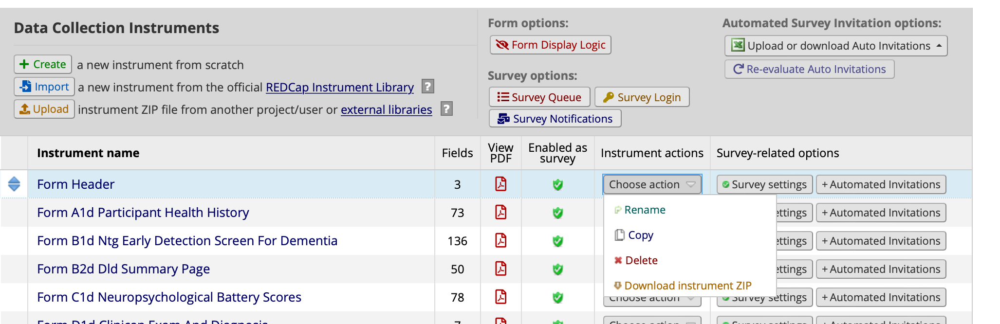
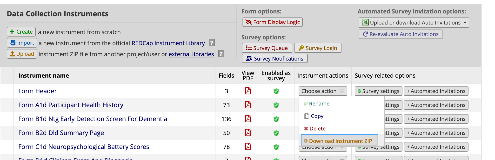

# Contributing

## Getting started

To work on/with this project, you will need to get a copy of the files in the repository.
You do this using [git](https://git-scm.com).

If you are completely new to git and GitHub, there are are a number of online resources, but a good place to start for this project is [Using Git](https://docs.github.com/en/get-started/using-git) in the [GitHub Docs](https://docs.github.com/).

To get your local copy (aka, clone) of this repository, do the following:
1. [Set up Git](https://docs.github.com/en/get-started/quickstart/set-up-git).
2. Choose a directory where you want to have your local copy of this repository.
2. [Clone the repository](https://docs.github.com/en/repositories/creating-and-managing-repositories/cloning-a-repository)

## Git workflow

In limited scenarios, you can add or edit files on GitHub, but in general you will need to [use Git](https://docs.github.com/en/get-started/using-git) to manage your changes and share them to the repository.
An [example of contributing to an existing repository](https://docs.github.com/en/get-started/using-git/about-git#example-contribute-to-an-existing-repository) is given in those documents.

The steps there are:
1. Clone the repository and change into the directory.
2. Create a new branch for your changes.
3. Switch to the new branch.
4. Make whatever changes are needed.
5. Add the changes to the branch.
6. Commit the changes.
7. Push the branch to GitHub.

## Documentation

Documentation is stored in the `docs` directory.

### Creating/Editing Markdown Documentation
You can do this either with a local clone, or by creating and editing files directly in the browser.

For details on working in the browser, see
* [Creating new files](https://docs.github.com/en/repositories/working-with-files/managing-files/creating-new-files), and
* [Editing Files](https://docs.github.com/en/repositories/working-with-files/managing-files/editing-files).

> Note: When you are done with your edits, under **Commit Changes** you should edit the commit message, and then choose "Create a new branch for this commit and start a pull request"

Create new documents as Markdown files (a file with a `.md` extension) in the `docs` directory.
Use the [GitHub Markdown](https://docs.github.com/en/get-started/writing-on-github/getting-started-with-writing-and-formatting-on-github/basic-writing-and-formatting-syntax)
format to make sure they display correctly on the site.

Images should be placed in the `docs/images` directory, and can be included in a markdown document.

More detail on writing documentation on GitHub is available under **Writing on GitHub** in the GitHub [Get Started](https://docs.github.com/en/get-started) docs.

### Using Word files

To add or modify Word documents, you will need to follow the Git workflow above.

To **add** a document

1. Create and switch to a new branch with a descriptive name for the addition.
2. Place your document in the `docs` directory of this repository.
3. Add the document with git, commit the changes, and push the branch.

To **modify** a document in a branch

1. Checkout the branch
2. Open the word document from the docs directory in your clone, and save your work
3. Add the document with git, commit the changes, and push the branch.


## Forms

Each form set is broken out into individual instruments for each form. 
For instance, the Down Syndrome module has five forms and the corresponding directory structure is

```bash
forms/ds
├── a1d
├── b1d
├── b2d
├── c1d
└── d1d
```

where each directory contains the exported instrument for the form.

### Adding/Updating an individual instrument

Before adding or updating a new instrument, create a new branch with an appropriate name using Git.
For instance, to add the initial A1D form for the Down Syndrome module, we could use

```bash
git checkout -b add-initial-ds-a1d
```

To export an individual instrument in REDCap

1. Open the Designer\
   
2. For the instrument you want to export, click the `Choose action` dropdown next to the instrument,

   

   and select `Download instrument ZIP`. 
   
   

This will save the downloaded file to the default location for your browser and OS settings.
On a Mac with the default settings, the file will be unzipped and saved in your `Downloads` directory with a name corresponding to the instrument name (e.g., `Downloads/FormA1dParticipantHe_2022-05-27_0749`).
On a Windows machine, you will likely have to unzip the file using the File Manager.

In this case, to move the file into the repository 

1. Make sure there is a directory for your instrument.
   For A1D of Down Syndrome module, this should be a directory `forms/ds/a1d`.
   All of these should already exist for most projects, but if not you can create the directory.
   If you aren't sure how, please ask.
2. Copy the file into the instrument directory.
   For A1D, the command on a Mac would be `cp ~/Downloads/FormA1dParticipantHe_2022-05-27_0749/*.* forms/ds/a1d`
3. Commit your changes and then push the branch to GitHub.


## Tools

NACC leadership needs to choose a license.
Please make sure the code license is established in the repository before adding code.

